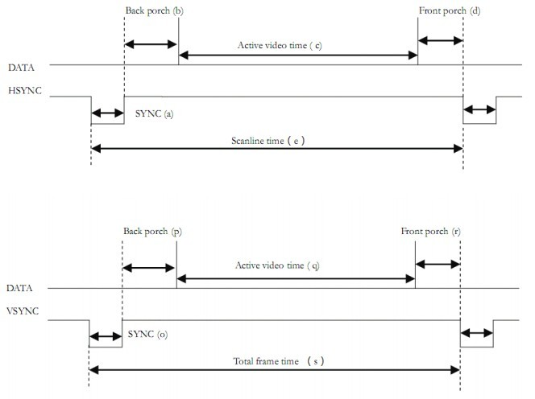
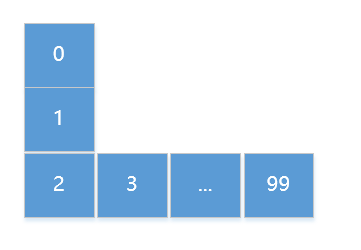

# FPGA 硬件设计
FPGA 是现场可编程逻辑门阵列的英文简写。它使用许多的硬件描述语言（HDL）来设计硬件。这一个学期我们学习了以 Verilog 作为 HDL 的数字电子技术。到了学期末，需要做出自己的东西，遇到了一些坑，所以写这篇文章的目的就是给自己留一个大概的印象。
# Verilog 语言
具体不需要介绍了，网上的资源也很多。我仅仅做一个备忘：

Verilog 的数据类型：
- net 类型：包括 wire 等。net 类似于导线，没有存储数据的功能和驱动能力。不能在 always 中赋值。只能出现在 assign 的左侧进行赋值。
- 变量数据类型：包括 reg 等。reg 可以被综合成 wire，register， latch 等，广泛用于时序逻辑电路的设计，有驱动能力和存储数据的功能。只能在 always 中赋值。


Verilog 有三种描述的方式：
- 门级描述方式：一般用于组合逻辑，其中定义了许多的逻辑门，例如：and，or，nand，bufif0 等待。一般语句的形式是 `<门> [<实例名>](输出, 参数1, 参数2,..., 参数n)`
- 数据流描述方式：`assign <lhs>=<rhs>; for lhs is wire`
- 行为描述方式：`always(<敏感列表>)`，敏感列表可以包含某个方波的上生沿（posedge）或者下降沿（negedge）或者某个输入的变量。注意敏感列表不是逻辑表达式！

# 准备
我们这个学期使用的板子是 Ego1 的板子。具体的硬件手册可以网上搜索
## VGA 扫描
分辨率由 水平方向的像素点数量 x 垂直方向的像素点数量 表示，者两组值越大，表示的像素就更多效果也越好。

显示器扫描方式分为：
- 逐行扫描：逐行扫描是扫描从屏幕左上角一点开始，从左像右逐点扫描，每扫描完一行,电子束回到屏幕的左边下一行的起始位置，在这期间，CRT对电子束进行消隐，每行结束时，用行同步信号进行同步；当扫描完所有的行，形成一帧，用场同步信号进行场同步，并使扫描回到屏幕左上方，同时进行场消隐,开始下一帧。
- 隔行扫描：隔行扫描是指电子束扫描时每隔一行扫一线，完成一屏后在返回来扫描剩下的线，隔行扫描的显示器闪烁的厉害，会让使用者的眼睛疲劳。 

**水平扫描时间：** 完成一行扫描的时间，其倒数称为行频率；完成一帧（整屏）扫描的时间称为垂直扫描时间，其倒数称为场频率，即刷新一屏的频率，常见的有60Hz，75Hz等等。标准的VGA显示的场频60Hz,行频31.5KHz。

**行场消隐信号：** 是针对老式显像管的成像扫描电路而言的。电子枪所发出的电子束从屏幕的左上角开始向右扫描，一行扫完需将电子束从右边移回到左边以便扫描第二行。在移动期间就必须有一个信号加到电路上，使得电子束不能发出。不然这个回扫线会破坏屏幕图像的。这个阻止回扫线产生的信号就叫作消隐信号,场信号的消隐也是一个道理。

**显示带宽：** 带宽指的显示器可以处理的频率范围。如果是60Hz刷新频率的VGA,其带宽达640x480x60=18.4MHz,70Hz的刷新频率1024x768分辨率的SVGA,其带宽达1024x768x70=55.1MHz。

**时钟频率：** 以640x480@59.94Hz(60Hz)为例，每场对应525个行周期(525=10+2+480+33),其中480为显示行。每场有场同步信号,该脉冲宽度为2个行周期的负脉冲，每显示行包括800点时钟,其中640点为有效显示区,每一行有一个行同步信号，该脉冲宽度为96个点时钟。由此可知：行频为525x59.94=31469Hz,需要点时钟频率：525x800x59.94约25MHz。

**在场同步有效期内（除了同步和消隐期内），插入 N（竖直方向像素数量）行水平扫描（行同步）信号，每路水平扫描信号负责屏幕上 M 个（水平像素数量）点的显示，当扫描面完 N 行 M 个点时，一帧的画面就完成了。**

各个阶段：
阶段|意义|阶段|意义
-|-|-|-
a|行同步段|o|帧同步段
b|显示后沿段|p|显示后沿段
c|显示有效段|q|显示有效段
d|显示前沿段|f|显示前沿段
e|行周期（e=a+b+c+d）|s|帧周期（s=o+p+q+f）
VGA 参数表：
显示模式|时钟(Mhz)|行时序(像素)|帧时序
-|-|-|-|-
640x480@60|25.175|a:96, b:48, c:640, d: 16, e:800|o:2, p:33, q:480, f:10, s:525
RGB 信号就可以用于表示屏幕对应点的颜色信息
## 蛇身体控制


蛇身是由块组成的，每个块有几个分量来表示对应的位置、是否存在的信息：
- is_exist[i]：蛇1的身体块是否存在，0<=i<蛇的长度
- cube_x[i]：保存的蛇1身体块对应于屏幕的水平坐标，单位是块，块的大小是水平32像素，高度32像素。
- cube_y[i]：保存的蛇1身体块对应于屏幕的纵向坐标，单位同cube_x[i]。蛇2与蛇1的身体控制同理

这样表示有几个缺点：
- 随着蛇身体的增长，由于向量的长度被限制，到了一定的时间蛇就不会增长了。
- 如果定义过大的长度，就会造成综合阶段时间过长（当长度为 1000 时，8 核 CPU 1个小时还未综合完成）。另外，最大长度与屏幕的分辨率也有关系。

我觉得有一个[好的方案](https://moooc.cc/archives/1704)就是动态检测对方玩家的蛇“块”的位置和本身的位置位置是否冲突，以及存储蛇的长度信息。但是有个问题亟待解决，Verilog 不太方便的定义类似于 C语言 中的二维数组 `integer[40:0] ki[30:0];` 的形式。

由于贪吃蛇有两个玩家，所以需要判断的情况有：
- 撞到身体和对方的身体
```verilog
begin:hit_loop
// 检测的是是否撞击身体
for(i=0;i<CUBE_SIZE-1;i=i+1)
    if(cube_y[0] == cube_y[i+1] && cube_x[0] == cube_x[i+1] && is_exist[i] == 1) begin
        hit_body <= 1;
        disable hit_loop;
    	end
	// 检测是否撞到了别的蛇
	else if(cube_y[0] == cube_y2[i] && cube_x[0] == cube_x2[i] && is_exist2[i] == 1) begin
		hit_snake2 <= 1;
		disable hit_loop;
	    end
...
```
- 撞到墙壁：cube 的第一个元素就是头的坐标，方向的话作为 direct 信号进行判断，因为玩家输入的方向与蛇运动的实际方向可能不一样，这取决于蛇之前运动方向
```verilog
//身体运动算法 本长度位移动的下个坐标为下一个长度位当前坐标 运动节拍按分频后的节奏
case(direct)							
	UP: begin
		if(cube_y[0] == 1)
			hit_wall <= 1;//头朝上，且已经是与墙的边界上
		else
			cube_y[0] <= cube_y[0]-1;
		end
									
	DOWN: begin
		if(cube_y[0] == 28)
			hit_wall <= 1;
		else
			cube_y[0] <= cube_y[0] + 1;
	end
		
	LEFT: begin
		if(cube_x[0] == 1)
			hit_wall <= 1;
		else
			cube_x[0] <= cube_x[0] - 1;			

	RIGHT: begin
		if(cube_x[0] == 38)
			hit_wall <= 1;
		else
			cube_x[0] <= cube_x[0] + 1;
	end
endcase				//根据按下按键判断是否撞墙 否则按规律改变头部坐标
```
## 边界情况
## 蓝牙通信 
# 参考
- [(CSDN)Verilog 中 wire 和 reg 数据类型区别](https://blog.csdn.net/wordwarwordwar/article/details/53717222)
- [(Wikipedia)FPGA](https://zh.wikipedia.org/wiki/%E7%8E%B0%E5%9C%BA%E5%8F%AF%E7%BC%96%E7%A8%8B%E9%80%BB%E8%BE%91%E9%97%A8%E9%98%B5%E5%88%97)
- [(cnblogs)[笔记]-VGA时序及其原理](https://www.cnblogs.com/spartan/archive/2011/08/16/2140546.html)
- 汤勇明 等，搭建你的数字积木：数字电路与逻辑设计：Verilog HDL & Vivado 版[M]. 北京：清华大学出版社，2017：222-223